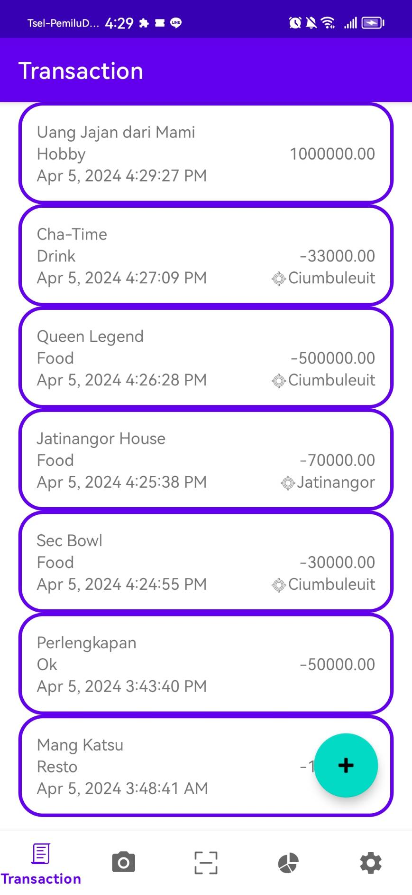
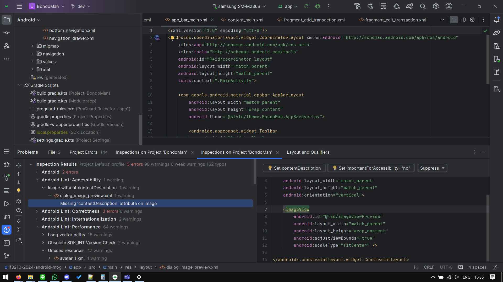

# Introduction

Bandung Bondowoso's transaction management app. The app is based on Android's platform. The dream app that can help record and manage your transaction! The app is made by genies at Genie Institute.

Bondoman helps users manage transactions with its adding, editing, and deleting transactions. The app also comes with various utilities (not so) related to the main transaction functionality

# Screenshots

# Accessiblity Check
Code inspection on Android Studio shows the following accessibility issue, which is the missing alt-text on dialog_image_preview.

Problem lies on this highlighted part of ImageView tag.

Quick fix for this issue is as shown below.

# What's contained in this project

## Libraries

The application uses several libraries:

* Room - manages data persistence in database & providing ORM for ease
* Retrofit & OkHttp - helps manage http requests
* Moshi & Gson - .json data parsing for http requests
* Android Play Services (Location) - location providing utility
* Dagger Hilt - helps inject dependencies for nested modules
* Apache POI - helps build `.xls` & `.xlsx` files
* MPAndroidChart - helps create graphs

### Reference links

- [MPAndroidChart by PhilJay](https://github.com/PhilJay/MPAndroidChart)

# Work distribution

| NIM      | Name                     | Work                                                                     | Total Time |
| -------- | ------------------------ | ------------------------------------------------------------------------ | ---------- |
| 13521067 | Yobel Dean Christopher   | Header-Navbar, Scan, Twibbon, Graph                                      | 69h        |
| 13521074 | Eugene Yap Jin Quan      | Login, Logout, JWT Service, Save Excel File, Send Email, Network Sensing | 69h        |
| 13521138 | Johann Christian Kandani | Transactions CRUD, Randomize Transactions                                | 69h        |
